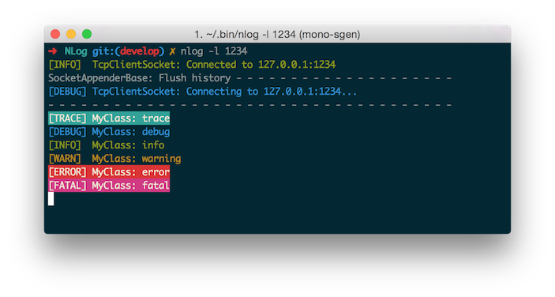
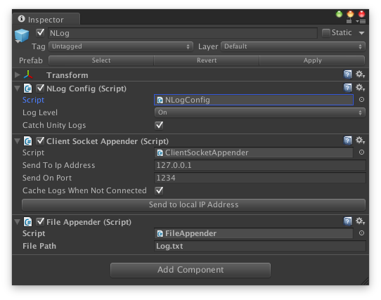

# NLog – Flexible logging for C# and Unity

NLog is a very light logging library with a clear focus on speed, flexibility and extensibility. It supports local and remote logging out of the box, which is extremely useful, if you want to receive log messages from a mobile device over the air.

[](https://gitter.im/sschmid/NLog?utm_source=badge&utm_medium=badge&utm_campaign=pr-badge&utm_content=badge)

branch  | tests
:------:|------
master  | [](https://travis-ci.org/sschmid/NLog)
develop | [](https://travis-ci.org/sschmid/NLog)

### [-> Install NLog](#install-nlog)

## Overview
NLog consists of the following modules

Module  | Content
:-------|:-------
NLog    | Contains the core classes incl. TCP sockets and appenders
NLog.CommandLineTool | Receive log messages via TCP in your terminal
NLog.Unity | Integrates NLog into Unity for code free setup

## Getting started

### LogLevel
NLog is a very light and flexible logging library. You can log messages based on their importance, e.g. you might want to log general messages with a debug log level, but unexpected messages with a warning log level. NLog provides the following log levels
- Trace
- Debug
- Info
- Warn
- Error
- Fatal

### Appender
Its plugin architecture lets you add multiple different appenders to handle log messages. An appender is a delegate method which contains the logic for processing log messages. It might write a message to a file, print it with Console.WriteLine, send it over the network via TCP, etc. You can easily write your own appenders. There are no limits!

NLog ships with a handful pre-made appenders and helper classes
- SocketAppender, either as TcpClientSocket or as TcpServerSocket
- SOSMaxAppender, which sends messages over the network to [SOSMax](http://www.sos.powerflasher.com)
- FileWriter

### Commandline Tool
To receive messages in your terminal, you can use the bundled commandline tool nlog.exe, which you can either setup as a TcpClientSocket or a TcpServerSocket.

```
$ nlog.exe
nlog [-l port]    - listen on port
nlog [-c ip port] - connect to ip on port
[-v]              - verbose output
[-vv]             - even more verbose output

# This will listen on port 1234
$ nlog.exe -l 1234

# This will connect to 127.0.0.1 on port 1234
$ nlog.exe -c 127.0.0.1 1234
```

### NLog.Unity
NLog.Unity adds even more appender. No code needed for setup!
- ClientSocketAppender
- ServerSocketAppender
- SOSMaxSocketAppender
- FileAppender
- DebugLogAppender

Implementing your appender is as easy as writing a single delegate method.

## Setup NLog

If you're using NLog with Unity, you can skip this section and [jump to 'Setup NLog in Unity'.](#setup-nlog-in-unity)

```cs
LoggerFactory.globalLogLevel = LogLevel.On;

// Add appender to print messages with Console.WriteLine
LoggerFactory.AddAppender((logger, logLevel, message) => Console.WriteLine(message));

// Add another appender to write messages to a file
var fileWriter = new FileWriter("Log.txt");
LoggerFactory.AddAppender((logger, logLevel, message) => fileWriter.WriteLine(message));

// Or simply create your own custom appender, e.g.
// a custom error reporter, which only sends messages
// if the log level is at least 'error'
LoggerFactory.AddAppender((logger, logLevel, message) => {
    if (logLevel >= LogLevel.Error) {
        myErrorReporter.Send(logLevel + " " + message);
    }
});
```

## Example
Send log messages over the network via TCP
```cs
// Setup appender
var defaultFormatter = new DefaultLogMessageFormatter();
var colorFormatter = new ColorCodeFormatter();
var socket = new SocketAppender();
LoggerFactory.AddAppender(((logger, logLevel, message) => {
    message = defaultFormatter.FormatMessage(logger, logLevel, message);
    message = colorFormatter.FormatMessage(logLevel, message);
    socket.Send(logLevel, message);
}));

// Setup as client
socket.Connect(IPAddress.Loopback, 1234);

// Or setup as server
// socket.Listen(1234);
```

```cs
public class MyClass {
    static readonly Logger _log = LoggerFactory.GetLogger(typeof(MyClass).Name);

    public MyClass() {
        _log.Trace("trace");
        _log.Debug("debug");
        _log.Info("info");
        _log.Warn("warning");
        _log.Error("error");
        _log.Fatal("fatal");
    }
}
```


Send log messages to SOSMax
```cs
var defaultFormatter = new DefaultLogMessageFormatter();
var socket = new SOSMaxAppender();
LoggerFactory.AddAppender(((logger, logLevel, message) => {
    message = defaultFormatter.FormatMessage(logger, logLevel, message);
    socket.Send(logLevel, message);
}));

socket.Connect(IPAddress.Loopback, 4444);
```


# Setup NLog in Unity
You don't have to write any code to setup NLog in Unity. Just drag the NLog prefab into your scene and you're ready to go.



By default, the NLog prefab has already a ClientSocketAppender attached but you can add or remove appenders to fit your requirements. In the image above I also added a FileAppender. The log level set in NLogConfig is applied to all loggers, which makes filtering messages very easy. You can also turn off completely.


When checking 'Catch Unity Logs' you can also handle all existing Debug.Log calls and send them via NLog.

# Install NLog
Each release is published with NLog.zip attached containing all source files you need. It contains
- NLog
- NLog.CommandLineTool
- NLog.Unity

[Show releases](https://github.com/sschmid/NLog/releases)

# Maintainer(s)
- [@sschmid](https://github.com/sschmid)
